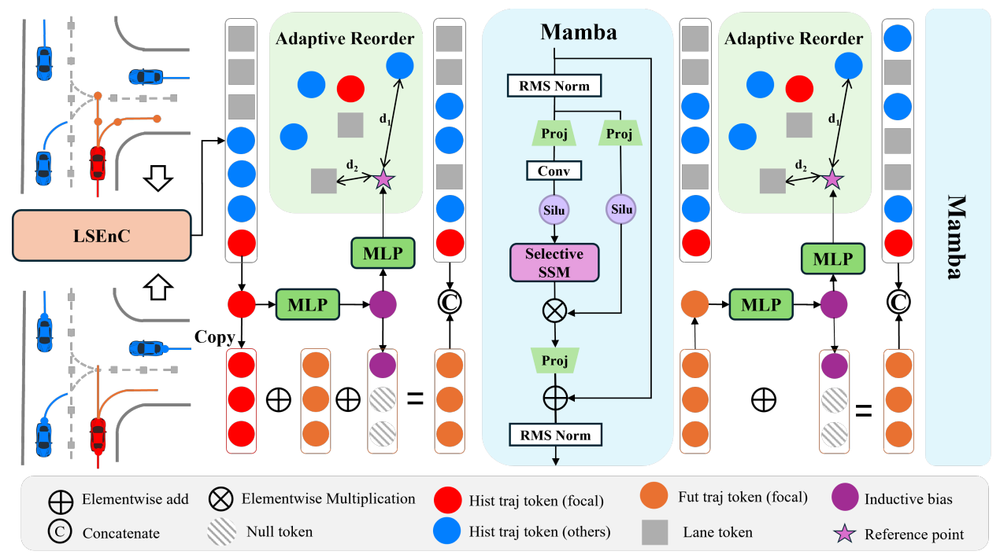
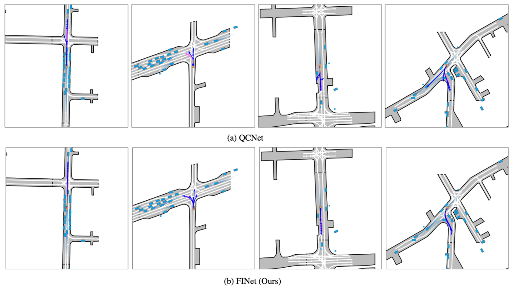

# [**Future-Aware Interaction Network For Motion Forecasting (ICCV2025)**](https://arxiv.org/pdf/2503.06565)

## Abstract
Motion forecasting is a crucial component of autonomous driving systems, enabling the generation of accurate and smooth future trajectories to ensure safe navigation to the destination. In previous methods, potential future trajectories are often absent in the scene encoding stage, which may lead to suboptimal outcomes. Additionally, prior approaches typically employ transformer architectures for spatiotemporal modeling of trajectories and map information, which suffer from the quadratic scaling complexity of the transformer architecture. In this work, we propose an interaction-based method, named Future-Aware Interaction Network, that introduces potential future trajectories into scene encoding for a comprehensive traffic representation. Furthermore, a State Space Model (SSM), specifically Mamba, is introduced for both spatial and temporal modeling. To adapt Mamba for spatial interaction modeling, we propose an adaptive reordering strategy that transforms unordered data into a structured sequence. Additionally, Mamba is employed to refine generated future trajectories temporally, ensuring more consistent predictions. These enhancements not only improve model efficiency but also enhance the accuracy and diversity of predictions. We conduct comprehensive experiments on the widely used Argoverse 1 and Argoverse 2 datasets, demonstrating that the proposed method achieves superior performance compared to previous approaches in a more efficient way. The code will be released according to the acceptance.

## 🎞️ Pipeline
<div align="center">
  
</div><br/>

## Install
Download third-party [module](https://1drv.ms/u/c/fe30fbdab18da9a9/ETuKKmgzSUlPqXSja4MeF2gBg_CUfu43p28K7_Qs1E4JjQ?e=jXIC0c) and unzip.

```
conda create -n FINet python=3.10
conda activate FInet
unzip thrid_party.zip
pip install -r requirements.txt
```

## Prepare the data (AV2)
### AV2 Data Structure
```
data_root
    ├── train
    │   ├── 0000b0f9-99f9-4a1f-a231-5be9e4c523f7
    │   ├── 0000b6ab-e100-4f6b-aee8-b520b57c0530
    │   ├── ...
    ├── val
    │   ├── 00010486-9a07-48ae-b493-cf4545855937
    │   ├── 00062a32-8d6d-4449-9948-6fedac67bfcd
    │   ├── ...
    ├── test
    │   ├── 0000b329-f890-4c2b-93f2-7e2413d4ca5b
    │   ├── 0008c251-e9b0-4708-b762-b15cb6effc27
    │   ├── ...
```

### Preprocess
```
python preprocess.py --data_root=/path/to/data_root -p
```

### The structure of the dataset after processing
```
└── data
    └── processed
        ├── train
        ├── val
        └── test
```

## Training and testing
```
# Train
python train.py 

# Evaluation
python eval.py

# Test for submission
python eval.py gpus=1 test=true
```

### Qualitative Results
<div align="center">
  
</div><br/>

## Reference
```bibtex
@inproceedings{zhang2024demo,
 title={Future-Aware Interaction Network For Motion Forecasting},
 author={Li, Shijie and Liu Chunyu and Xu, Xun and Yeo, Si Yong and Yang, Xulei},
 booktitle={ICCV},
 year={2025},
}
```
